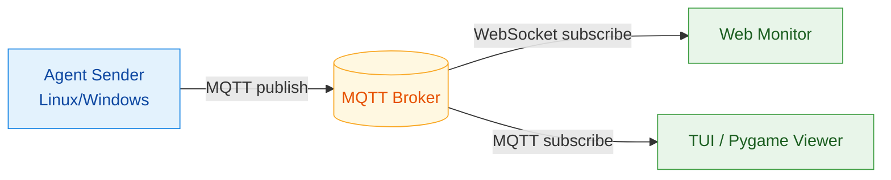
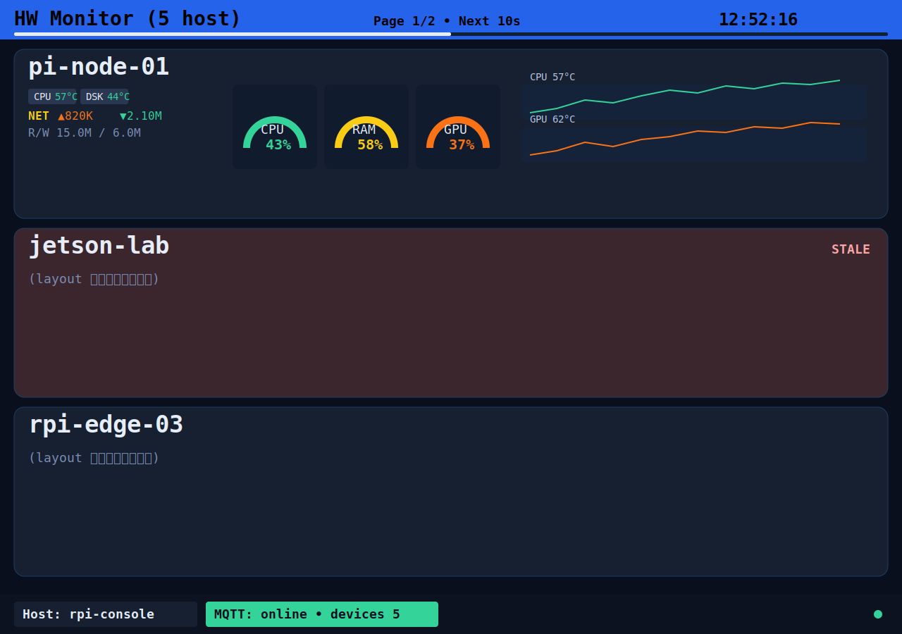
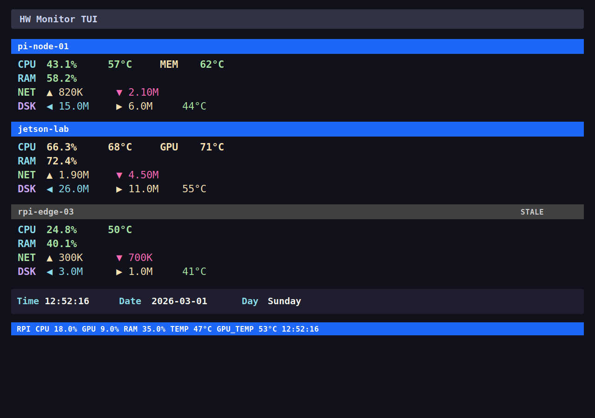

# hwmonitor-mqtt

[](https://www.docker.com/)
[](https://www.python.org/)
[](https://mqtt.org/)
[](./LICENSE)

把硬體監控變成「即時可視化資料流」：
- Agent 低負擔採集 CPU/RAM/Disk/Network/GPU/Temperature。
- MQTT 做資料總線，支援多主機擴充。
- Web 與本機 Viewer 即時呈現，不必重後端。

## 為什麼值得用

- 低門檻：`docker compose` 一鍵起服務。
- 低耦合：採集、訊息、顯示分離。
- 可擴展：同時支援 Linux / Windows Agent 與 ESP 輕量 payload。
- 可維護：文件與 Python 檔案已分層，路徑更清楚。

## 架構圖（含圖例）



### 圖例說明

- 藍色節點：資料生產者（Agent）
- 黃色節點：訊息中樞（Broker）
- 綠色節點：資料消費者（Web/TUI/Pygame）
- 箭頭標籤：通訊方式（`MQTT publish` / `subscribe` / `WebSocket`）

## Viewer 預覽

### PyGame Viewer



### TUI Viewer



## 專案結構

```text
.
├─ hwmonitor_mqtt/
│  ├─ agents/
│  │  ├─ agent_sender_async.py
│  │  └─ agent_sender_windows.py
│  └─ viewers/
│     ├─ pygame_viewer.py
│     └─ tui_viewer.py
├─ wifi_portal/
├─ docs/
│  ├─ getting-started/
│  ├─ architecture/
│  ├─ deployment/
│  ├─ configuration/
│  ├─ hardware/
│  └─ troubleshooting/
├─ tests/
└─ docker-compose.yml
```

> 主要執行入口已統一到 `hwmonitor_mqtt/` 套件路徑。

## 快速開始

### 1. 設定環境

```bash
cp .env.example .env
```

至少設定：`BROKER_HOST`、`BROKER_PORT`、`MQTT_USER`、`MQTT_PASS`。

### 2. 啟動模式

只啟動 Agent：

```bash
docker compose --profile agent up -d
```

完整模式（Agent + Broker + Web）：

```bash
docker compose --profile full up -d
```

ESP 輕量模式：

```bash
docker compose --profile esp-agent up -d
```

### 3. 觀察狀態

```bash
docker compose ps
docker compose logs -f
```

Web 介面預設：`http://localhost:8088`

## 文件入口

- [文件中心](./docs/README.md)
- [快速開始](./docs/getting-started/quickstart.md)
- [部署說明](./docs/deployment/docker-profiles.md)
- [環境變數](./docs/configuration/env-vars.md)
- [系統架構](./docs/architecture/system-overview.md)
- [硬體設定](./docs/hardware/README.md)
- [疑難排解](./docs/troubleshooting/common-issues.md)

## Python 開發

本專案有 `pyproject.toml`，建議使用 `uv`：

```bash
uv sync
uv run pytest -q
```

## 授權

本專案採用 `GNU GPL v3.0`。  
可商用，但散佈修改版或衍生作品時，需依 GPL 條款提供對應原始碼。詳見 [LICENSE](./LICENSE)。
