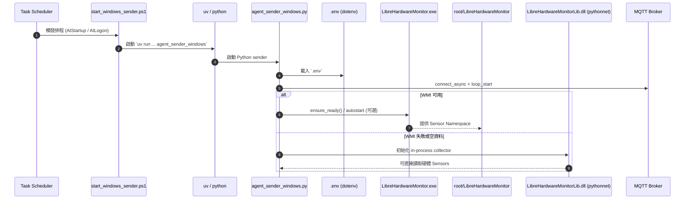
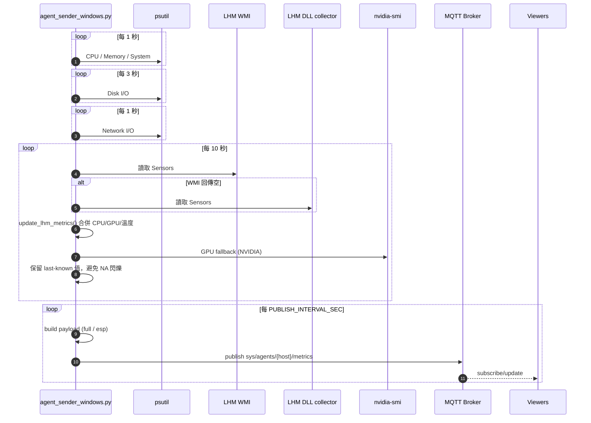

# Windows Sender 運作時序圖

本文描述 `hwmonitor_mqtt/agents/agent_sender_windows.py` 在 Windows 上的啟動、資料收集與發佈流程。

## 主要組件

- `Task Scheduler`：排程觸發 sender 啟動。
- `start_windows_sender.ps1`：啟動入口，負責 `uv run` 或直接 `python -m`。
- `uv` / `.venv`：Python 環境與依賴管理。
- `agent_sender_windows.py`：核心 sender，負責收集與發佈。
- `python-dotenv`：載入 `.env`。
- `psutil`：CPU / Memory / Disk / Network 基礎指標。
- `wmi` + `LibreHardwareMonitor.exe`：WMI 感測資料來源（`root/LibreHardwareMonitor`）。
- `pythonnet` + `LibreHardwareMonitorLib.dll`：WMI 失敗時的 in-process 感測 fallback。
- `nvidia-smi`：NVIDIA GPU fallback。
- `MQTT Broker`：接收 sender 發佈的 metrics。
- `Viewers`（Web / Pygame / TUI）：訂閱並顯示 metrics。

## 啟動時序

## 運行時序（輪詢與發佈）

## 互動重點

- Windows sender 使用「多來源合併」：`WMI -> DLL fallback -> nvidia-smi fallback`。
- 發佈前會保留前一輪有效值，避免單次輪詢缺值導致 Viewer 閃爍 `NA`。
- 多 GPU 以穩定裝置識別合併，降低部分感測缺值時遺失次要 GPU 的機率。
